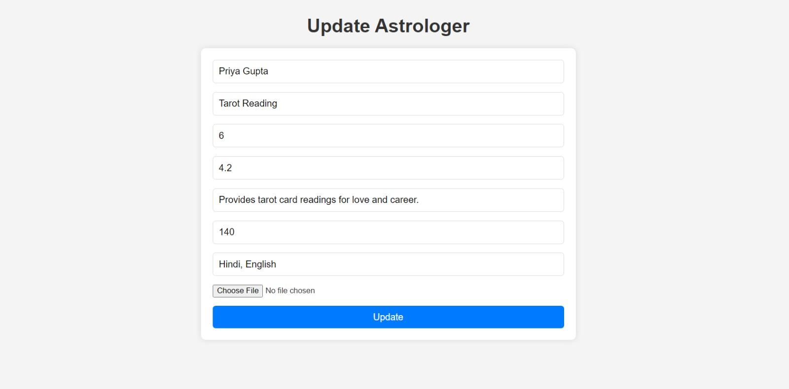

# Astrologer Management Platform

This project is a full-stack web application for managing astrologers. It allows users to create, update, view, and delete astrologer profiles. The home page features pagination and filtering capabilities for efficient browsing and searching.

## Features

- **Paginated Home Page**: Browse through astrologer profiles with pagination.
- **Filter Search**: Filter astrologers by name, expertise, and experience.
- **CRUD Operations**: Create, read, update, and delete astrologer profiles.
- **Image Upload**: Upload and update astrologer profile images.
- **Responsive Design**: User-friendly interface for both desktop and mobile devices.

## Screenshots

### Home Page


### Filter Search


### Astrologer Details


### Create Astrologer


### Update Astrologer


## Technologies Used

### Frontend

- React (with Vite)
- React Router DOM
- CSS (custom styling)

### Backend

- Node.js
- Express.js
- MongoDB (Mongoose for ODM)
- Multer (for handling image uploads)

## Installation

1. **Clone the repository:**

    ```bash
    git clone git@github.com:sednikhil/Midheaven-assi.git
    cd Midheaven-assi
    ```

2. **Install dependencies for both client and server:**

    ```bash
    cd client
    npm install
    cd ../server
    npm install
    ```

3. **Set up environment variables:**

    Create a `.env` file in the `server` directory and add your MongoDB URI:

    ```
    MONGODB_URI=your_mongodb_connection_string
    ```

4. **Run the application:**

    Open two terminal windows.

    In the first terminal, start the server:

    ```bash
    cd server
    npm start
    ```

    In the second terminal, start the client:

    ```bash
    cd client
    npm run dev
    ```

5. **Open your browser:**

    Navigate to `http://localhost:3000` to view the application.

## Usage

### Home Page

- The home page displays a list of astrologer profiles with pagination.
- Use the search and filter options to find astrologers by name, expertise, or experience.

### Create Astrologer

- Navigate to the "Create Astrologer" page to add a new astrologer profile.
- Fill in the form and upload an image for the astrologer.

### Update Astrologer

- Click on an astrologer's name to view their profile.
- Click the "Edit" button to update the astrologer's details and image.

### Delete Astrologer

- Click on an astrologer's name to view their profile.
- Click the "Delete" button to remove the astrologer from the list.

## Project Structure

- `client`: Contains the frontend code (React components, CSS).
- `server`: Contains the backend code (Express routes, controllers, models).

## API Documentation

For detailed API documentation, please refer to our Postman collection: [Postman API Documentation](https://documenter.getpostman.com/view/29608820/2sA3kYhKex)

## Contact

For any questions or feedback, please contact [nikhilguptaforms@gmail.com].
